  <!-- Branded Hero Banner -->
  

  <!-- Dynamic Typing Subtitle -->
  

  

    
    
    
    
  

---

### 👨‍💻 About Me

I am passionate about building resilient, high-performance systems spanning from bare-metal embedded hardware up to modern multimodal AI architectures and interactive web applications.

- **Education**: Bachelor of Engineering (Software Engineering) (Honours) @ **RMIT University Vietnam** (Class of 2025–2029)
- **Academic Performance**: Cumulative GPA **3.8 / 4.0**
- **Core Interests**: Generative AI, Large Language Models (LLMs), RAG & Agentic Systems, Embedded Systems & Robotics, Performance Engineering
- **Location**: Ho Chi Minh City, Vietnam
- **Live Portfolio**: [**vugiahung.is-a.dev**](https://vugiahung.is-a.dev)

---

### 🛠️ Technical Arsenal

<table align="center" width="100%">
  <tr>
    <td width="22%"><b>Programming</b></td>
    <td>
      
      
      
    </td>
  </tr>
  <tr>
    <td><b>Tools &amp; Hardware</b></td>
    <td>
      
      
      
    </td>
  </tr>
  <tr>
    <td><b>AI &amp; ML Interests</b></td>
    <td>
      
      
      
      
      
    </td>
  </tr>
  <tr>
    <td><b>STEM</b></td>
    <td>
      
      
    </td>
  </tr>
  <tr>
    <td><b>Languages</b></td>
    <td>
      
      
    </td>
  </tr>
  <tr>
    <td><b>Interpersonal</b></td>
    <td>
      
      
      
      
      
    </td>
  </tr>
</table>

---

### 📊 GitHub Activity & Metrics

  <table border="0">
    <tr>
      <td>
        
      </td>
      <td>
        
      </td>
    </tr>
  </table>

   

  <!-- Contribution Grid Snake Animation -->
  <picture>
    <source media="(prefers-color-scheme: dark)" srcset="https://raw.githubusercontent.com/vu-gia-hung/vu-gia-hung/output/github-contribution-grid-snake-dark.svg" />
    <source media="(prefers-color-scheme: light)" srcset="https://raw.githubusercontent.com/vu-gia-hung/vu-gia-hung/output/github-contribution-grid-snake.svg" />
    
  </picture>

---

### 🌐 Connect With Me

  <!-- Direct Emails -->
  

    
    
  

  <!-- Professional Presence -->
  

    
    
    
  

  <!-- Casual Socials -->
  

    
    
    
    
    
    
    
    
  

  Built by <a href="https://vugiahung.is-a.dev">Vũ Gia Hưng</a>

