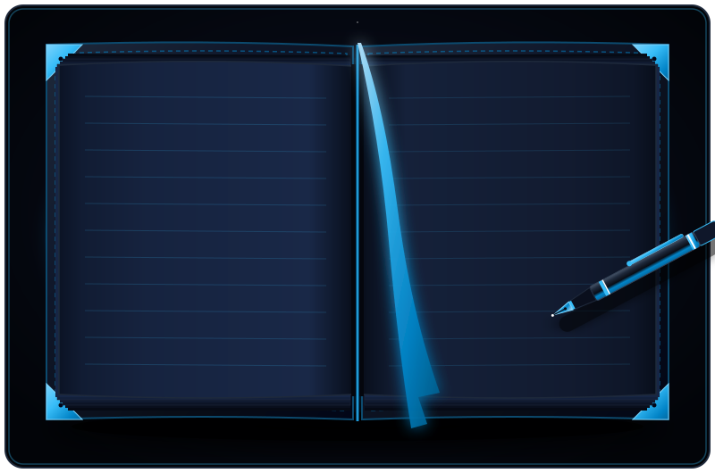
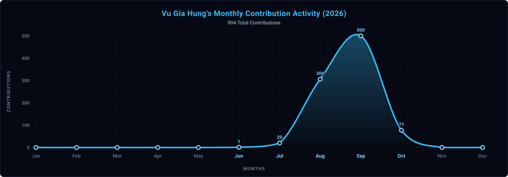
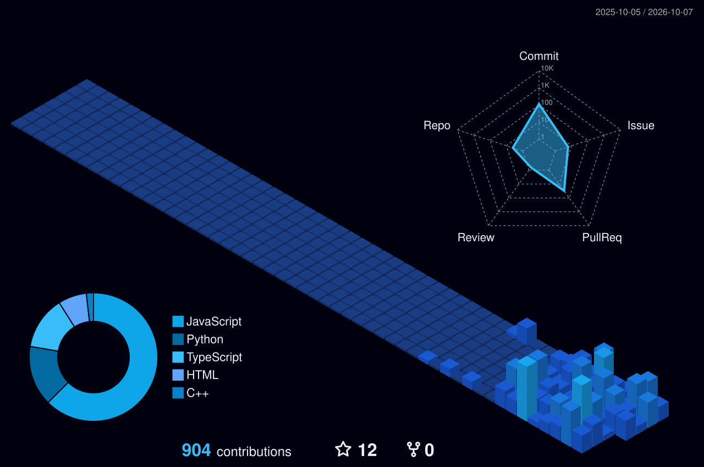

  <!-- Branded Hero Banner -->
  <a href="https://vugiahung.is-a.dev">
    <picture>
      <source media="(prefers-color-scheme: dark)" srcset="./assets/banner.svg" />
      <source media="(prefers-color-scheme: light)" srcset="./assets/banner-light.svg" />
      
    </picture>
  </a>

  <!-- Dynamic Typing Subtitle -->
  <a href="https://vugiahung.is-a.dev">
    <picture>
      <source media="(prefers-color-scheme: dark)" srcset="https://readme-typing-svg.demolab.com?font=JetBrains+Mono&weight=600&size=20&duration=3000&pause=1200&color=38BDF8&center=true&vCenter=true&random=false&width=750&lines=Software+Engineering+(Honours)+%40+RMIT+University+Vietnam;AI%2C+Large+Language+Models+%26+Agentic+Systems;Embedded+Firmware%2C+Robotics+%26+Circuit+Design;Performance+%26+Benchmark+Engineer+(AEGIS+VBS+2027);Interactive+3D+WebGL+%26+Modern+Full-Stack+Architect" />
      <source media="(prefers-color-scheme: light)" srcset="https://readme-typing-svg.demolab.com?font=JetBrains+Mono&weight=600&size=20&duration=3000&pause=1200&color=0284C7&center=true&vCenter=true&random=false&width=750&lines=Software+Engineering+(Honours)+%40+RMIT+University+Vietnam;AI%2C+Large+Language+Models+%26+Agentic+Systems;Embedded+Firmware%2C+Robotics+%26+Circuit+Design;Performance+%26+Benchmark+Engineer+(AEGIS+VBS+2027);Interactive+3D+WebGL+%26+Modern+Full-Stack+Architect" />
      
    </picture>
  </a>

  

    
    
     
    
    
     
    
    
  

---

<table border="0" width="100%" cellspacing="0" cellpadding="8">
<tr>
<td width="50%" align="center" valign="top">

  

 

</td>
<td width="50%" valign="top">
<!-- GUESTBOOK:START -->

 
 
<small style="color: #8b949e;">Leave a message on the left to appear here!</small>

&nbsp;<b><a href="https://github.com/Articial-space">@Articial-space</a></b> <small style="color: #8b949e;">• 2026-09-28 14:05</small> 
&nbsp;💬 <i>"Hung was a smart guy, however, he is ga..."</i>

&nbsp;<b><a href="https://github.com/s4126139">@s4126139</a></b> <small style="color: #8b949e;">• 2026-09-28 14:04</small> 
&nbsp;💬 <i>"He’s the genius of geniuses."</i>

<small><a href="https://github.com/vu-gia-hung/vu-gia-hung/issues?q=is%3Aissue+guestbook">View all messages &rarr;</a></small>

<!-- GUESTBOOK:END -->

</td>
</tr>
</table>

---

### 👨‍💻 About Me

I am passionate about building resilient, high-performance systems spanning from bare-metal embedded hardware up to modern multimodal AI architectures and interactive web applications.

- **Education**: Bachelor of Engineering (Software Engineering) (Honours) @ **RMIT University Vietnam** (Class of 2025–2029)
- **Academic Performance**: Cumulative GPA **3.8 / 4.0**
- **Core Interests**: Generative AI, Large Language Models (LLMs), RAG &amp; Agentic Systems, Embedded Systems &amp; Robotics, Performance Engineering
- **Location**: Ho Chi Minh City, Vietnam
- **Live Portfolio**: [**vugiahung.is-a.dev**](https://vugiahung.is-a.dev)

---

### 🛠️ Technical Arsenal

<table align="center" width="100%">
  <tr>
    <td width="22%"><b>Programming</b></td>
    <td>
      
      
      
    </td>
  </tr>
  <tr>
    <td><b>Computer Science</b></td>
    <td>
      
      
      
    </td>
  </tr>
  <tr>
    <td><b>Tools &amp; Hardware</b></td>
    <td>
      
      
      
      
      
    </td>
  </tr>
  <tr>
    <td><b>AI &amp; ML Interests</b></td>
    <td>
      
      
      
      
      
    </td>
  </tr>
  <tr>
    <td><b>STEM</b></td>
    <td>
      
      
    </td>
  </tr>
  <tr>
    <td><b>Languages</b></td>
    <td>
      
      
    </td>
  </tr>
  <tr>
    <td><b>Interpersonal</b></td>
    <td>
      
      
      
      
      
    </td>
  </tr>
</table>

---

### 📊 GitHub Activity & Metrics

  <!-- Core Stats & Streak Cards -->
  <table border="0">
    <tr>
      <td>
        <picture>
          <source media="(prefers-color-scheme: dark)" srcset="https://github-readme-stats-fast.vercel.app/api?username=vu-gia-hung&show_icons=true&theme=tokyonight&bg_color=060913&title_color=38bdf8&text_color=94a3b8&icon_color=38bdf8&border_color=1e293b&ring_color=38bdf8&hide_border=false" />
          <source media="(prefers-color-scheme: light)" srcset="https://github-readme-stats-fast.vercel.app/api?username=vu-gia-hung&show_icons=true&theme=default&bg_color=ffffff&title_color=0284c7&text_color=475569&icon_color=0284c7&border_color=e2e8f0&ring_color=0284c7&hide_border=false" />
          
        </picture>
      </td>
      <td>
        <picture>
          <source media="(prefers-color-scheme: dark)" srcset="https://streak-stats.demolab.com/?user=vu-gia-hung&theme=tokyonight&background=060913&ring=38bdf8&fire=38bdf8&currStreakLabel=38bdf8&currStreakNum=38bdf8&sideNums=cbd5e1&sideLabels=94a3b8&dates=94a3b8&border=1e293b&hide_border=false" />
          <source media="(prefers-color-scheme: light)" srcset="https://streak-stats.demolab.com/?user=vu-gia-hung&theme=default&background=ffffff&ring=0284c7&fire=0284c7&currStreakLabel=0284c7&currStreakNum=0284c7&sideNums=1e293b&sideLabels=64748b&dates=64748b&border=e2e8f0&hide_border=false" />
          
        </picture>
      </td>
    </tr>
  </table>

    

  <!-- GitHub Trophy Showcase -->
  <picture>
    <source media="(prefers-color-scheme: dark)" srcset="./assets/trophies-dark.svg" />
    <source media="(prefers-color-scheme: light)" srcset="./assets/trophies-light.svg" />
    
  </picture>

    

  <!-- Contribution Grid Snake Animation -->
  <picture>
    <source media="(prefers-color-scheme: dark)" srcset="https://raw.githubusercontent.com/vu-gia-hung/vu-gia-hung/output/github-contribution-grid-snake-dark.svg" />
    <source media="(prefers-color-scheme: light)" srcset="https://raw.githubusercontent.com/vu-gia-hung/vu-gia-hung/output/github-contribution-grid-snake.svg" />
    
  </picture>

    

  <!-- Contribution Activity Wave Graph -->
  <picture>
    <source media="(prefers-color-scheme: dark)" srcset="./assets/activity-graph-dark.svg" />
    <source media="(prefers-color-scheme: light)" srcset="./assets/activity-graph-light.svg" />
    
  </picture>

    

  <!-- 3D Isometric Contribution Graph -->
  <picture>
    <source media="(prefers-color-scheme: dark)" srcset="./profile-3d-contrib/profile-night-view.svg" />
    <source media="(prefers-color-scheme: light)" srcset="./profile-3d-contrib/profile-green.svg" />
    
  </picture>

---

### 🌐 Connect With Me

  <!-- Direct Emails & Live Portfolio -->
  

    
    
    
  

  <!-- Professional & Academic Presence (Matches Portfolio Top Row) -->
  

    
    
    
  

  <!-- Casual Socials (Matches Portfolio Bottom Row) -->
  

    
    
    
    
     
    
    
    
    
  

  Built by <a href="https://vugiahung.is-a.dev">Vũ Gia Hưng</a>

